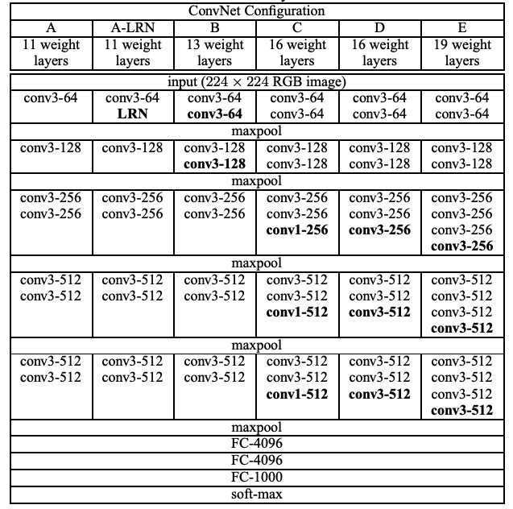

# VGGNet Implementation with Pytorch

## 0. Develop Environment
- Docker Image : tensorflow/tensorflow:1.13.2-gpu-py3-jupyter
- Pytorch : Stable (1.5) - Linux - Python - CUDA (10.2)
- Using Single GPU (not tested on cpu only)

## 1. Explain about Implementation
- model.py : vgg11, vgg11_bn, vgg13, vgg13_bn, vgg16, vgg16_bn, vgg19, vgg19_bn
- train.py : train model
- utils.py : count right prediction, save checkpoints
- Add adaptive average pooling layer before FC layer for shape issues

## 2. Brief Summary of *'Very Deep Convolutional Networks for Large-scale Image Recognition'*

### 2.1. Goal
- Improve performance of image classification and localization on ILSVRC-2014

### 2.2. Intuition
- Best performing submissions on ILSVRC-2013 utilized smaller receptive window size and smaller stride of the first convolutional layer
- Experiments of architecture parameter depth for performance

### 2.3. Dataset
- ILSVRC-2012 dataset
  * train : 1.3 M
  * val : 50 K
  * test : 100 K

### 2.4. VGGNet Configurations

- Conv3 : window size 3 * 3, stride 1, padding 1
- Maxpool : window size 2 * 2, stride 2
- Acitivation function : ReLU

### 2.5. Classification Task
#### 2.5.1. Train  
- Data Pre-processing
  * Random resize : resize with shorter side randomly sampled in [256, 512]
  * Random crop 224 * 224
  * Random horizontal flipping
  * Random RGB color shift
  * Normalization : subtract mean RGB value computed on training dataset from each pixel
- Train Details
  * Multinomial logistic regression objective
  * Mini-batch gradient descent based on backpropagation
    * Batch size : 256
    * Learning rate : 0.01
    * Momentum : 0.9
    * L2 weight decay : 0.0005
  * Learning rate scheduler : decrease by a factor of 10 when the validation set accuracy stopped improving
  * Dropout : 0.5 ratio for first 2 FC layer
  * Epoch : 74 (370k iterations)

#### 2.5.2. Test
- Data Pre-processing
  * Resize : resize with shorter side (224, 256, 288), (256, 384, 512), (352, 384, 416)
  * Multi-crop + dense evaluation
- Network Change
  * FC layers -> convolutional layers
    * First FC layer -> 7 × 7 convolution layer
    * Last 2 FC layers -> 1 × 1 convolution layers
  * Add average pooling at end : to obtain a fixed-size vector
- Ensemble
  * Combine the outputs of several models by averaging their soft-max class posteriors
  * Improves the performance due to complementarity of the models

### 2.6. Localization Task : bounding box + classification
- Bounding box prediction
  * 4-D vector : center coordinates, width, and height
  * Single-class Regression (SCR) : bounding box prediction is shared across all classes
  * Per-class Regression (PCR) : bounding box prediction is class-specific
  * PCR > SCR
- Difference
  * Fix-scale train image 'S' : 256, 384
  * Random crop -> central crop
  * Logistic regression objective -> Euclidean loss
  * Learn from scratch -> fine-tuning (learning rate : 0.001)
  * Output : set of bounding box predictions (4-D in SCR, 4000-D in PCR)
  * Greedy merging procedure
    * Merge spatially close predictions by averaging coordinates
    * Rate based on the class scores, obtained from the classification ConvNet
    * When several localization ConvNets are used, take the union of their sets of bounding box predictions, and then run the merging procedure on the union

## 3. Reference Paper
- Very Deep Convolutional Networks for Large-scale Image Recognition [[paper]](https://arxiv.org/pdf/1409.1556.pdf)
